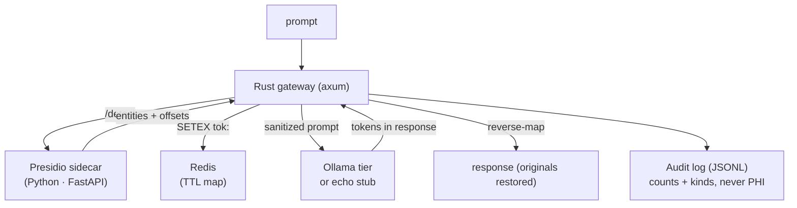

<p align="center">
  <h1>🛡️ Secure AI Gateway</h1>
  <p><b>PHI-aware AI routing — detect, tokenize, tier-route, audit</b></p>
  <p>
    <a href="https://github.com/akarales/secure-ai-gateway/actions/workflows/ci.yml"></a>
    
    
    
    
  </p>
</p>

A working demo of the ZAP Runtime gateway architecture applied to protected
health information: every prompt that crosses the model boundary is
**detected** (Presidio sidecar), **tokenized** (`<PERSON_ab12cd34>` with a
TTL Redis map), **tier-routed** (complexity model selection), and
**reverse-mapped** on return — with an append-only audit log recording
every hop. Rust (axum) core; the PHI detector is a small Python Presidio
sidecar, the one component with no serious Rust equivalent.

**Jump to:** [Features](#-features) · [Architecture](#-architecture) · [Quickstart](#-quickstart) · [Configuration](#️-configuration) · [API](#-api) · [Docs](#-documentation) · [Roadmap](#️-roadmap)

> [!CAUTION]
> Demo application — not HIPAA-certified. Never route real PHI through a
> demo gateway. Raw PHI never enters the audit log, but the pipeline
> itself is for demonstration only.

## ⚡ Features

- **PHI never crosses the model boundary** — prompts are sanitized
  before the model sees them; responses are restored before the user does
- **Tokenization with TTL** — Redis `SETEX` token→original map
  (in-process fallback for offline); deterministic tokens the model can
  reason over
- **Tiered routing** — the ZAP Runtime model-router pattern: clinical
  context or long prompts route to the capable tier
- **Audit without exposure** — append-only JSONL records entity counts
  and kinds, never values
- **Offline-everything stubs** — detector, model, and token store all
  have stub modes; `cargo test` needs no Python, Redis, or GPU (an
  in-test axum server impersonates Presidio)

## 📐 Architecture



## 🚀 Quickstart

```bash
# Fully offline: stub detector + stub model + memory tokens
APP_DETECTOR_STUB=true APP_MODEL_STUB=true APP_REDIS_STUB=true \
  cargo run --bin secure-ai-gateway    # :8005

curl -X POST localhost:8005/api/v1/gateway/chat \
  -H 'content-type: application/json' \
  -d '{"prompt":"Patient John Smith has a question about his medication"}'

# Full stack: Redis + Presidio sidecar + Ollama
docker compose up --build
```

Sidecar development (optional): see [docs/DEVELOPMENT.md](docs/DEVELOPMENT.md).

## ⚙️ Configuration

| Variable | Default | Notes |
|----------|---------|-------|
| `APP_DETECTOR_URL` | `http://localhost:8006` | Presidio sidecar |
| `APP_DETECTOR_STUB` | `false` | stub detects nothing (offline) |
| `APP_REDIS_URL` | `redis://localhost:6380` | token map (compose exposes 6380) |
| `APP_REDIS_STUB` | `false` | in-process token map (offline) |
| `APP_TOKEN_TTL` | `3600` | token-map seconds |
| `APP_OLLAMA_URL` / `APP_OLLAMA_MODEL` | `…:11434` / `qwen3:14b` | model tier |
| `APP_MODEL_STUB` | `false` | echoes the sanitized prompt (offline loop) |
| `APP_AUDIT_PATH` | `data/audit.jsonl` | append-only JSONL |
| `APP_PORT` | `8005` | 8000–8004 taken on this machine |

## 📡 API

| Endpoint | Purpose |
|----------|---------|
| `GET /health` | liveness |
| `POST /api/v1/gateway/chat` | full PHI-aware proxy round trip |
| `POST /api/v1/gateway/route` | routing preview (which tier, why) |

The chat response includes `sanitized_prompt` (what the model saw),
`phi_detected`, `entity_kinds`, `tier`, and the restored `response` —
the whole pipeline observable in one payload. Full anatomy:
[docs/API.md](docs/API.md).

## 📚 Documentation

| Page | What's inside |
|------|---------------|
| [docs/ARCHITECTURE.md](docs/ARCHITECTURE.md) | Pipeline stages, token format, audit safety rules, the Presidio decision |
| [docs/API.md](docs/API.md) | Chat + route endpoints with full payload anatomy |
| [docs/DEVELOPMENT.md](docs/DEVELOPMENT.md) | Stub modes, sidecar setup (uv + spaCy), testing strategy |

## 🗺️ Roadmap

<details>
<summary>Phased plan</summary>

- [x] Phase 0 — scaffold: pipeline, stubs, audit, CI
- [ ] Phase 1 — streaming responses (NDJSON) with token restoration
- [ ] Phase 2 — real model routing (qwen3:8b/14b); WireGuard-only
      listener policy
- [ ] Phase 3 — per-tenant PHI classes + redaction deny lists

</details>

## 🤝 Contributing

PRs welcome — see [CONTRIBUTING.md](CONTRIBUTING.md). Gates: `cargo
clippy --workspace --all-targets -- -D warnings`, `cargo test --workspace -q`.

## 📄 License

MIT — see [LICENSE](LICENSE).
